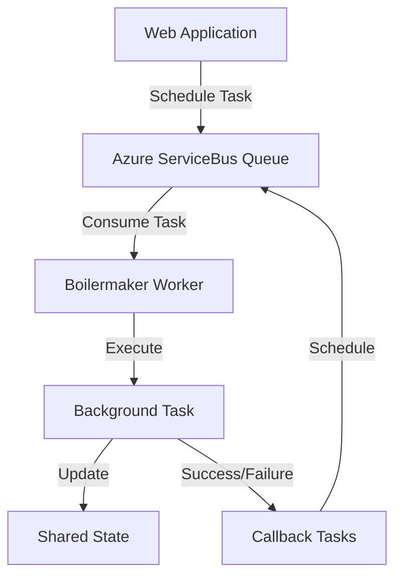
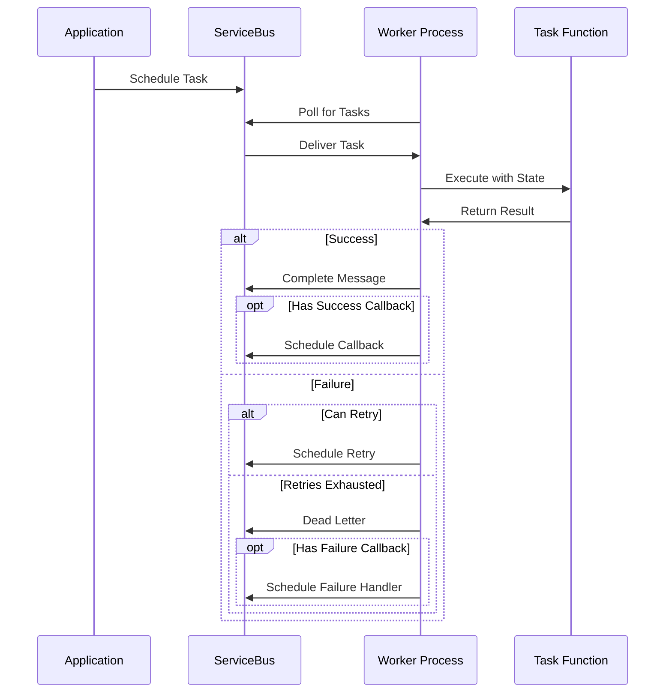

# Basic Concepts

Understanding these core concepts will help you use Boilermaker effectively.

## Architecture Overview



## Core Components

### 1. Tasks

Tasks are **async functions** that run in the background. They must:

- Be `async` functions
- Take `state` as the first parameter
- Be JSON-serializable in their arguments

```py
async def my_task(state, user_id: str, priority: str = "normal"):
    """A background task that processes user data."""
    # Task logic here
    return "Task completed"
```

### 2. Application State

The **state** object is shared across all tasks in a worker process:

```py
class AppState:
    def __init__(self):
        self.database = get_db_connection()
        self.cache = {}
        self.metrics = {"processed": 0}

app = Boilermaker(AppState(), service_bus_client)
```

!!! tip "State Best Practices"
    - Keep state lightweight and focused
    - Use dependency injection patterns
    - Avoid storing large objects in memory

### 3. The Boilermaker App

The `Boilermaker` class orchestrates everything:

```py
from boilermaker import Boilermaker

app = Boilermaker(
    state=your_app_state,           # Shared state
    service_bus_client=client,      # Azure ServiceBus client
    enable_opentelemetry=False      # Optional tracing
)
```

### 4. Task Registration

Register tasks before they can be executed:

```py
# Method 1: Decorator
@app.task()
async def decorated_task(state, data):
    return data.upper()

# Method 2: Explicit registration
async def regular_task(state, data):
    return data.lower()

app.register_async(regular_task, policy=retries.RetryPolicy.default())
```

### 5. Scheduling vs Execution

**Scheduling** happens in your main application:

```py
# In your web app, API, etc.
await app.apply_async(my_task, "arg1", keyword="arg2")
```

**Execution** happens in dedicated worker processes:

```py
# In your worker process
await app.run()  # Runs forever, processing tasks
```

## Task Lifecycle



## Message Acknowledgment Patterns

Boilermaker supports two acknowledgment patterns:

### Acks Late (Default)

Tasks are acknowledged **after** successful completion:

```py
task = app.create_task(my_function)
task.acks_late = True  # Default
```

- ✅ **At-least-once** delivery guarantee
- ✅ No data loss if worker crashes
- ❌ Possible duplicate processing

### Acks Early

Tasks are acknowledged **before** execution:

```py
task = app.create_task(my_function)
task.acks_late = False
```

- ✅ **At-most-once** delivery guarantee
- ✅ No duplicate processing
- ❌ Possible data loss if worker crashes

## Retry Policies

Control how tasks behave when they fail:

```py
from boilermaker import retries

# Fixed delay retry
policy = retries.RetryPolicy(
    max_tries=3,
    delay=60,           # 60 seconds between retries
    retry_mode=retries.RetryMode.Fixed
)

# Exponential backoff
policy = retries.RetryPolicy(
    max_tries=5,
    delay=30,           # Starting delay
    delay_max=3600,     # Maximum delay (1 hour)
    retry_mode=retries.RetryMode.Exponential
)

# Linear backoff
policy = retries.RetryPolicy(
    max_tries=4,
    delay=30,           # 30s, 60s, 90s, 120s
    retry_mode=retries.RetryMode.Linear
)
```

## Error Handling Strategies

### 1. Automatic Retries

Raise `RetryException` to trigger retry logic:

```py
from boilermaker.retries import RetryException

async def fragile_task(state, data):
    try:
        result = await external_api_call(data)
        return result
    except TransientError:
        raise RetryException("API temporarily unavailable")
    except PermanentError:
        # Don't retry permanent errors
        raise
```

### 2. Failure Results

Return `TaskFailureResult` to mark a task as permanently failed:

```py
from boilermaker.failure import TaskFailureResult

async def validation_task(state, email):
    if not is_valid_email(email):
        return TaskFailureResult  # Don't retry, trigger failure callback

    return send_email(email)
```

### 3. Dead Letter Handling

Configure dead letter behavior:

```py
task = app.create_task(my_function)
task.should_dead_letter = True   # Send failed messages to dead letter queue
task.should_dead_letter = False  # Just complete failed messages
```

## Task Callbacks and Chaining

### Success Callbacks

Run a task when another succeeds:

```py
main_task = app.create_task(process_data, "input")
success_task = app.create_task(send_notification, "success")

main_task.on_success = success_task
# or
main_task >> success_task  # Syntactic sugar
```

### Failure Callbacks

Run a task when another fails:

```py
main_task = app.create_task(risky_operation, data)
failure_task = app.create_task(send_alert, "failure")

main_task.on_failure = failure_task
```

### Task Chains

Chain multiple tasks together:

```py
workflow = app.chain(
    app.create_task(step1, data),
    app.create_task(step2),
    app.create_task(step3),
    on_failure=app.create_task(cleanup_handler)
)

await app.publish_task(workflow)
```

## Configuration and Environment

### Environment-based Configuration

```py
from boilermaker.config import Config

# Automatically reads from environment variables
config = Config()
# Uses SERVICE_BUS_NAMESPACE_URL and SERVICE_BUS_QUEUE_NAME

# Or specify explicitly
config = Config(
    service_bus_namespace_url="https://my-namespace.servicebus.windows.net",
    service_bus_queue_name="my-queue"
)
```

### Azure Authentication

Boilermaker uses `DefaultAzureCredential`:

=== "Development"
    ```bash
    az login  # Uses your Azure CLI credentials
    ```

=== "Production"
    ```bash
    # Set service principal credentials
    export AZURE_CLIENT_ID="your-client-id"
    export AZURE_CLIENT_SECRET="your-client-secret"
    export AZURE_TENANT_ID="your-tenant-id"
    ```

=== "Azure Environments"
    ```py
    # Managed Identity is used automatically
    config = Config(azure_credential_include_msi=True)
    ```

## Next Steps

- **[Task Registration](../guides/task-registration.md)** - Learn different registration patterns
- **[Retry Policies](../guides/retry-policies.md)** - Triggering retries on errors
